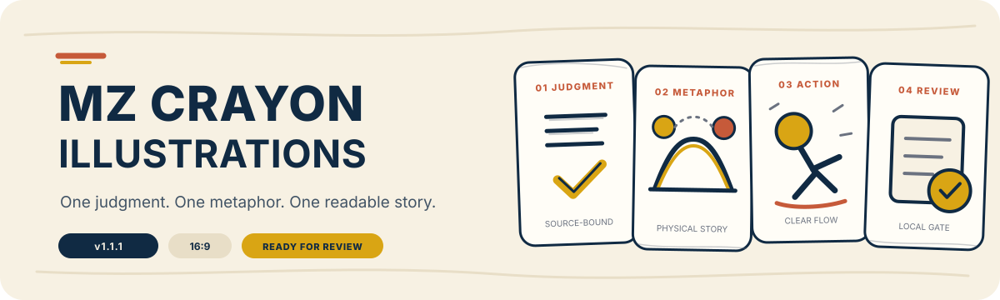
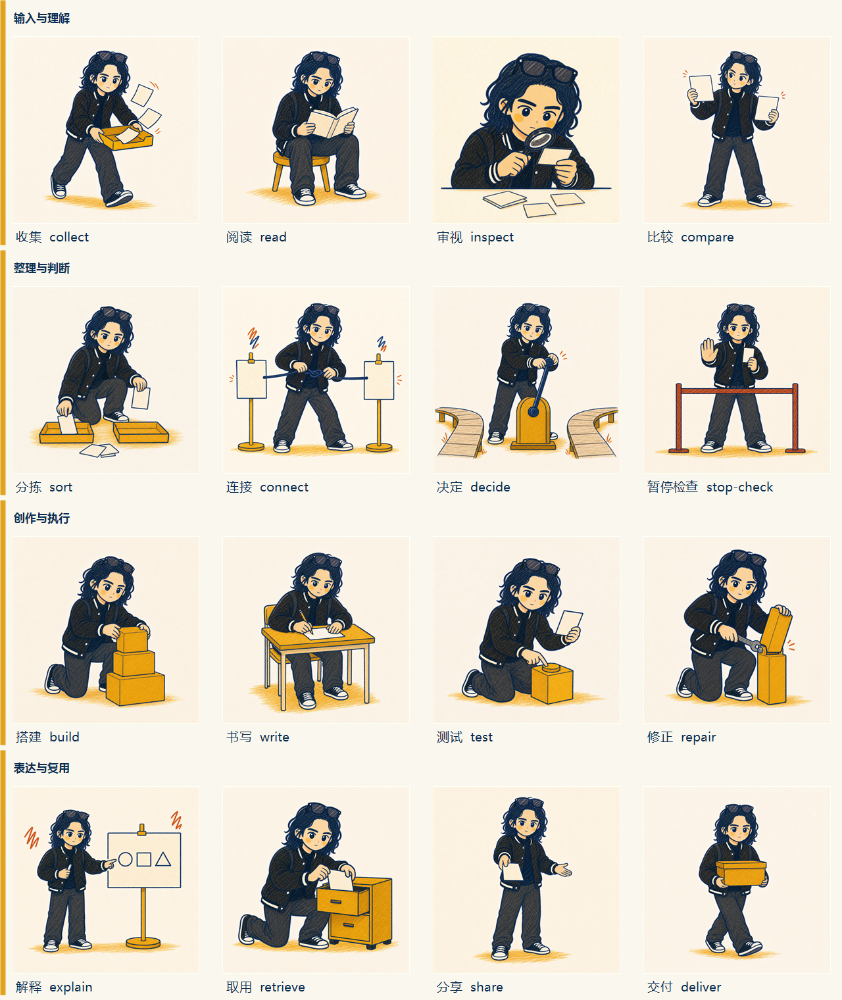

<p align="right"><a href="README.md">English</a></p>

<p align="center">
  
</p>

# MZ Crayon Illustrations

一个判断，一个物理隐喻，一条清晰的 16:9 故事流。

MZ Crayon Illustrations 是一个面向知识内容、评审优先的 Agent Skill。它保持独立的 Muzi 讲述者身份，事实标签只来自用户提供的材料，并停在本地 `READY_FOR_REVIEW`。

## 认识动作系统



只有当语义与构图真正匹配时，Skill 才会选择这 16 个动作之一。遇到比较、环境、序列或复杂互动，单个动作无法自然表达时，它会切换到受控 `free` 动作。

| 动作模式 | 适用条件 |
| --- | --- |
| `library` | 一个语义动作及其手部与物件关系能够承载当前判断。 |
| `free` | 画面需要比较、环境、序列或多物件互动。 |

## 始终锁定的部分

- **Muzi 身份** — 独立、跨项目的知识讲述者，不是 Munan 品牌吉祥物。
- **视觉 DNA** — 蜡笔质感、暖白留白、深海军蓝轮廓、芥末黄块面与克制的锈红色批注。
- **来源忠实** — 具名事实、物件与 3–6 个中文短标签只来自用户提供的内容。
- **叙事焦点** — 一个判断、一个原创物理隐喻、一条可读故事流。
- **伙伴边界** — 可选布偶猫只辅助场景，不成为知识物件，也不取代 Muzi。

## 从判断到评审

1. **提取一个判断** — 不把整篇文章或多个平行观点塞进一张图。
2. **设计物理故事** — 确定信息结构、原创隐喻、物件角色、Muzi 动作、伙伴状态、标签与留白区。
3. **生成并检查** — 创建 1672×941 PNG，再检查身份、解剖、蜡笔媒介、构图、角色、流向、标签与伙伴状态。
4. **写入评审证据** — 校验 `creator.muzi-crayon-review/3` 记录并停在 `READY_FOR_REVIEW`；连续失败时停止，不写入有效评审。

## 安装

使用 Codex 从 `main` 安装当前 v1.1.1 代码：

```text
$skill-installer install https://github.com/MuziGeek/mz-crayon-illustrations/tree/main/mz-crayon-illustrations
```

当前最新已发布标签仍为 `v1.0.0`；在 v1.1.1 Release 发布前，请使用 `main` 获取 v1.1.1 的 Visual Engine 交接能力。

## 第一次使用

```text
Use $mz-crayon-illustrations to turn this article's main judgment into one 16:9 knowledge illustration.
Use $mz-crayon-illustrations to show why collecting information is not the same as retrieving it.
```

## MZ Visual Engine 交接

Skill 只接受用于 `knowledge-illustration + mz-crayon-v2` 的已校验 `mz.visual-brief/1`。Brief 可以携带 Intent、内容约束与锁定标签，但不能覆盖 Muzi 身份、伙伴规则、动作选择、来源事实、QA 或用户验收。

## 评审与发布边界

生成、本地 QA、用户验收与外部发布是彼此独立的阶段。Skill 不会上传、发布、替换账号资产、自动检索未经批准的外部事实、编造事实标签或声称用户已验收。

## 许可证

代码与文档使用 MIT 许可证；MZ/Muzi 参考图像使用 [MZ Reference Asset License 1.0](ASSET_LICENSE.md)。具体见 [NOTICE.md](NOTICE.md)。
